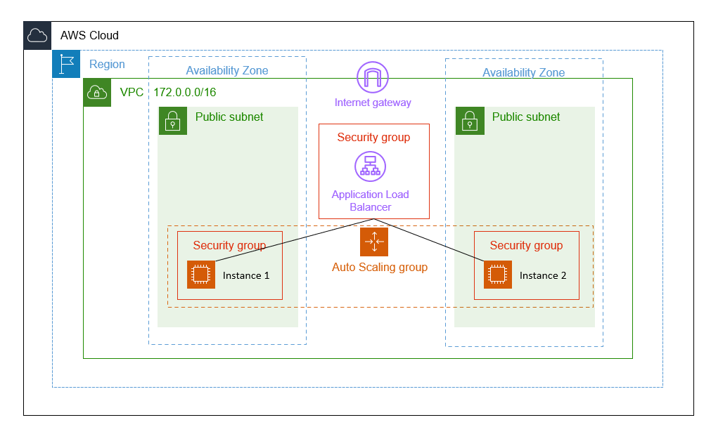

## HA on AWS with Terrafrom

**This HA Content with**
1. Load Balancing
2. AutoScalling
3. HTTPD



**How to run this project**
1. Fill access_key and secret_key in provider.tf
2. Run this command
   ```
   terraform init
   ```
3. If ssh key didn't exist yet run this command
   ```
   ssh-keygen ec2-example-ssh-key
   ```
4. Make sure configuration
   ```
   terraform plan
   ```
5. Apply configuration into AWS Console
   ```
   terraform apply --auto-approve
   ```

**delete resource**
```
terraform destroy --auto-approve
```
